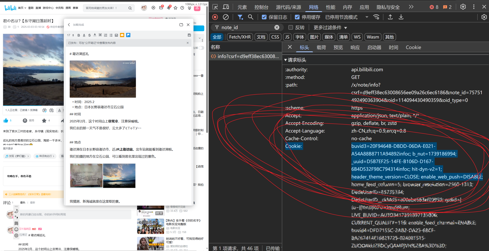

# bili-note-md

把哔哩哔哩视频的笔记导出为markdown格式。

> [!TIP]  
> 本项目需要使用Python 3.10.5+，更老的版本没测试过。需要在环境中安装好`requests`：
>
> ```bash
> python -m pip install -U requests
> ```

## Features

当前已经实现的特性：

- `# x`、`## xx`和`### xxx`会自动转换为一二三级**标题**。
- 哔哩哔哩笔记中插入的**图片**会自动下载到本地，并且用markdown的格式插入到对应的位置。
- **粗体**的格式会保留。
- **无序列表**也会保留。

其他特性尚未支持：

- [x] <s>字号控制</s>（无实现计划）
- [ ] 中划线
- [ ] 下划线
- [ ] 有序列表
- [ ] 文本颜色
- [ ] 文本高亮
- [ ] 时间标记

## Demo

例如：


可以导出为：


## 公开笔记

如果是公开的笔记，只需要提供cvid即可：

```bash
$ python open.py
请输入cvid:
```

> [!TIP]  
> 如何获取cvid?
>
> 先打开浏览器的开发者工具，然后打开你要导出的笔记，最后在搜索框里搜索`cvid`就可以找到对应的请求了：
> 
>
> 可以看到我这篇笔记的cvid是`41101828`

## 私有笔记

如果是（自己的）**未公开**的笔记，则需要使用cookie进行身份认证才可以顺利导出。

```bash
$ python private.py
请输入cookie:
请输入note_id:
请输入oid:
```

根据提示依次输入

- cookie
- note_id
- oid

即可。

> [!TIP]  
> 如何获取cookie, note_id, oid?
>
> 如法炮制，还是使用开发者工具，这次我们搜索`note_id`：
> 
>
> 可以看到我这篇笔记的note_id是`75751492490363904`，oid是`114094430490359`。
>
> 完事儿了往下滑，cookie可以在请求标头里找到：
> 
